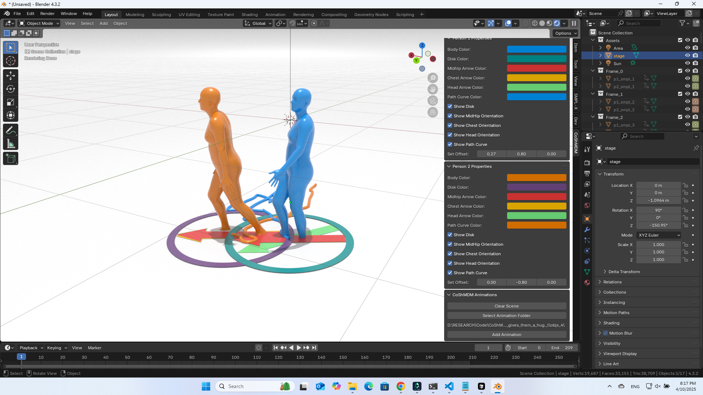
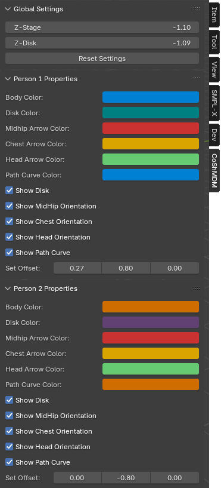
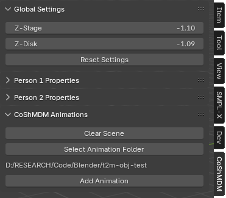

# BlebdMoGen Blender-Addon
Blender addon implements unified motion generation pipeline for rendering text-to-motion, interaction generation, and reaction motion generation. (https://incepters53.github.io/blendmogen/).



## Getting started

### Download and Install Blender

* Download and install blender https://www.blender.org/download/.
* `{VER}` = your blender version, replace it accordingly.
* Blender>Preferences>Interface> Check Developer Options
* Add the following paths to PATH environment variable.
```shell
C:\Program Files\Blender Foundation\Blender {VER}
C:\Program Files\Blender Foundation\Blender {VER}\{VER}\python\bin
```
* Run CMD as Administrator and follow these commands:
```shell
"C:\Program Files\Blender Foundation\Blender {VER}\{VER}\python\bin\python.exe" -m ensurepip --upgrade
"C:\Program Files\Blender Foundation\Blender {VER}\{VER}\python\bin\python.exe" -m pip install matplotlib --target="C:\Program Files\Blender Foundation\Blender {VER}\{VER}\scripts\modules"
"C:\Program Files\Blender Foundation\Blender {VER}\{VER}\python\bin\python.exe" -m pip install hydra-core --target="C:\Program Files\Blender Foundation\Blender {VER}\{VER}\scripts\modules"
"C:\Program Files\Blender Foundation\Blender {VER}\{VER}\python\bin\python.exe" -m pip install hydra_colorlog --target="C:\Program Files\Blender Foundation\Blender {VER}\{VER}\scripts\modules"
"C:\Program Files\Blender Foundation\Blender {VER}\{VER}\python\bin\python.exe" -m pip install shortuuid --target="C:\Program Files\Blender Foundation\Blender {VER}\{VER}\scripts\modules"
"C:\Program Files\Blender Foundation\Blender {VER}\{VER}\python\bin\python.exe" -m pip install omegaconf --target="C:\Program Files\Blender Foundation\Blender {VER}\{VER}\scripts\modules"
"C:\Program Files\Blender Foundation\Blender {VER}\{VER}\python\bin\python.exe" -m pip install moviepy==1.0.3 --upgrade  --target="C:\Program Files\Blender Foundation\Blender {VER}\{VER}\scripts\modules"
```

### Create SMPL mesh per frame

```shell
python -m visualize.render_mesh --input_path ./results/In_an_intense_boxing_match,_one_is_continuously_/ --repetition_num 0
```

**This script outputs:**
* `p1_smpl_params.npy` and `p2_smpl_params.npy` - SMPL parameters (thetas, root translations, vertices and faces)
* `obj_rep###` - Mesh per frame in `.obj` format.


## Blender Addon for CoShMDM

After corresponding OBJ files for generated in P1 and P2 folders, you can install and use our blender addon to load the interaction animations in blender and render them. You can follow our following repository fot [CoShMDM-Blender-Addon](https://github.com/Incepters53/blendmogen.git).




